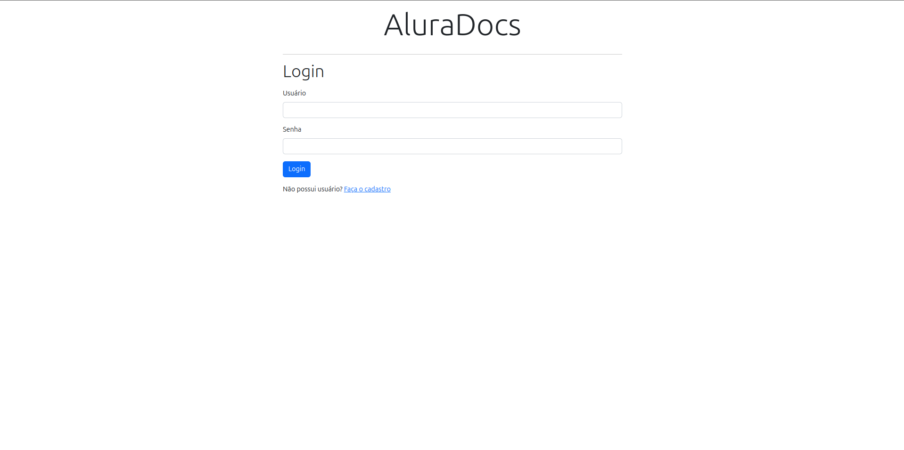
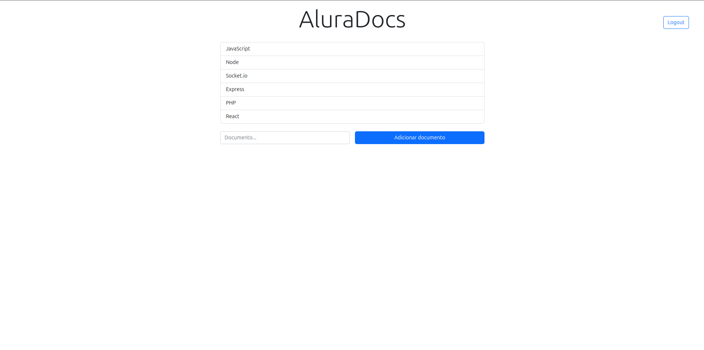
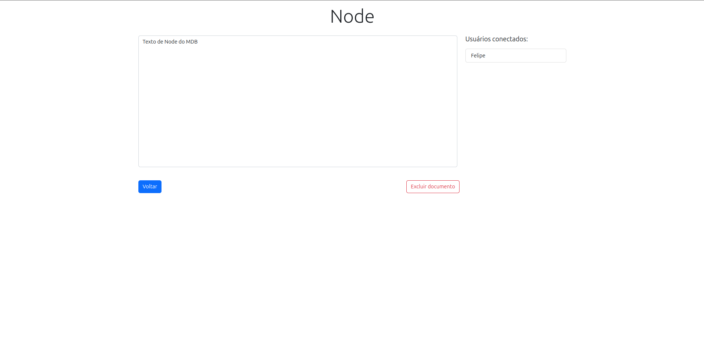

# About

Alura-App is event-driven software that uses Socket.io to manage documents and users connected to those documents. Users can simultaneously connect to documents and exchange messages through it.

Here some images:

## Available Scripts

After downloading this project, go to the project and use:

### `npm install`

In the project directory, you can run:

### `npm run dev`

Runs the app in the development mode.\
Open [http://localhost:3000](http://localhost:3000) to view it in the browser.

The page will reload if you make edits.\
You will also see any lint errors in the console.

### Database

I'm using MongoDB so you'll need to use it too. You can create a cloud database using MongoDB Atlas. Here's the link: 
https://account.mongodb.com/account/login?n=https%3A%2F%2Fcloud.mongodb.com%2Fv2%2F663bccbaa1d88033bcb1e338&nextHash=%23overview&signedOut=true

You can also use the following commands:

### `npm test`

Launches the test runner in the interactive watch mode.\
See the section about [running tests](https://facebook.github.io/create-react-app/docs/running-tests) for more information.

### `npm run build`

Builds the app for production to the `build` folder.\
It correctly bundles React in production mode and optimizes the build for the best performance.

The build is minified and the filenames include the hashes.\
Your app is ready to be deployed!

See the section about [deployment](https://facebook.github.io/create-react-app/docs/deployment) for more information.

## Learn More

You can learn more in the [Create React App documentation](https://facebook.github.io/create-react-app/docs/getting-started).

To learn React, check out the [React documentation](https://reactjs.org/).
